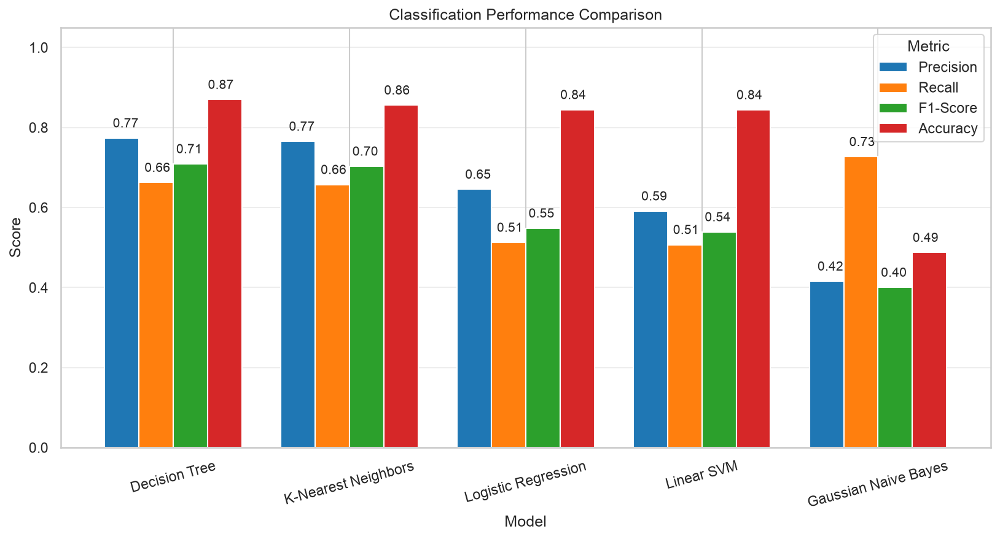

# Traffic Incident Severity Mining

An end-to-end data-mining project for predicting **traffic-incident severity** from accident reports, time, location, weather, and road-condition signals.

> Course project — Data Mining

## Overview

The project frames incident severity (`y`) as a multiclass classification task. It follows a leakage-aware workflow: inspect and clean the data, create useful features, split before fitting preprocessing steps, select features on the training data, tune several classifiers with cross-validation, and evaluate the final choice on held-out data.

## What the notebook does

- Audits data types, missingness, duplicates, whitespace, infinite values, and potential outliers.
- Explores class imbalance, numeric distributions, categories, and correlations.
- Engineers time-based, text-derived, keyword, and geographic-distance features.
- Applies train-only imputation, rare-category grouping, one-hot encoding, scaling, and feature alignment.
- Selects a compact feature subset with decision-tree importance and stratified cross-validation.
- Compares Logistic Regression, Decision Tree, Gaussian Naive Bayes, k-NN, and Linear SVM.
- Uses **macro F1** as the primary metric to treat all severity classes fairly.
- Saves the selected features, final metrics, classification report, and confusion matrix in `results/`.

## Repository layout

```text
.
├── code/
│   ├── main.ipynb      # Complete analysis and modelling workflow
│   └── notebook.ipynb  # Kaggle-ready version with original column names
├── data/
│   ├── data.csv        # Training data
│   └── test.csv        # Additional labelled test data
├── docs/
│   ├── Report.pdf      # Project report
│   ├── Project_Description_DM4042_Update1.pdf
│   └── archive/        # Archived project deliverables
├── results/            # Generated tables and visualisations
├── requirements.txt    # Environment dependencies
└── README.md
```

## Getting started

```bash
git clone https://github.com/esmailiyan/traffic-incident-severity-mining.git
cd traffic-incident-severity-mining
python -m venv .venv
source .venv/bin/activate  # Windows: .venv\\Scripts\\activate
pip install jupyter numpy pandas matplotlib seaborn scikit-learn
jupyter notebook code/main.ipynb
```

Run the notebook from top to bottom. Generated artefacts are written to `results/`; the notebook reads its inputs from `data/` using relative paths.

For the Kaggle version, upload `code/notebook.ipynb`, add the [US Accidents (2016–2023)](https://www.kaggle.com/datasets/sobhanmoosavi/us-accidents) dataset as an input, and run the notebook in Kaggle.

## Methodology

1. **Data understanding & cleaning** — identify column roles and resolve quality issues.
2. **Exploratory analysis** — inspect distributions, imbalance, categories, and redundancy.
3. **Feature engineering** — derive predictive signals without using the target.
4. **Leakage-safe preparation** — split first; fit all preprocessing only on training data.
5. **Feature selection & tuning** — use stratified cross-validation and macro F1.
6. **Final evaluation** — compare the held-out test performance and inspect the confusion matrix.

## Model comparison



The chart compares five classifiers on the held-out test set. **Decision Tree** achieved the best macro F1 score (0.709) and accuracy (0.870), so it was selected as the final model. Macro F1 is especially useful here because it gives every severity class the same importance.

## Notes

- `RANDOM_STATE = 42` makes the data split and model-selection steps reproducible.
- The target labels are kept as supplied in the dataset.
- The notebook intentionally retains IQR-flagged observations; they can represent meaningful real-world incidents.

## License

This repository is provided for educational purposes.
